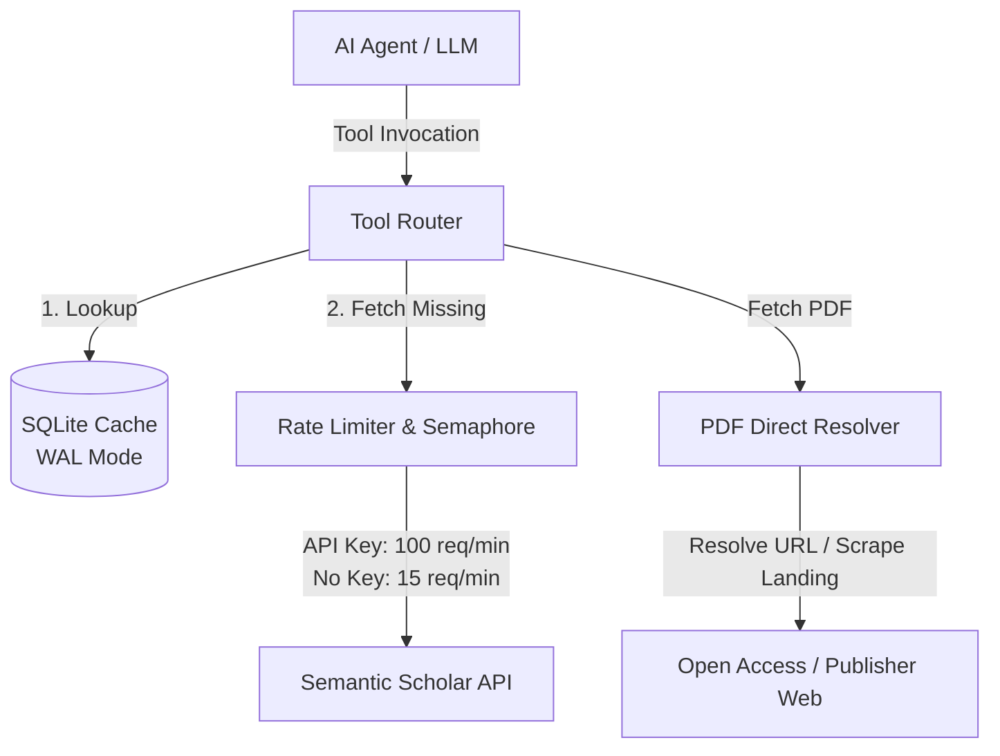

# 🎓 Smart Semantic Scholar MCP Server

[](https://modelcontextprotocol.io/)
[](https://python.org)
[](https://opensource.org/licenses/MIT)

An intelligent **Model Context Protocol (MCP)** server for the **Semantic Scholar API**. Specifically engineered for AI agents (like Claude, Cursor, and Zed) to conduct deep, rigorous academic literature reviews without exhausting token limits, getting rate-limited, or repeating identical API queries.

---

## 🗺️ System Architecture



---

## 🧠 Why is it "Smart"?

Standard API wrappers pass requests directly, leading to rapid rate-limiting (HTTP 429) or bloated token contexts. This server acts as a **stateful, optimizing research layer**:

*   **Discovery-First Workflow:** Agents are guided to perform broad, lightweight keyword searches to get unique `paperId`s first, only requesting detailed metadata (like full abstracts or authors) when needed.
*   **Enriched Persistent Memory:** A local SQLite cache (running in WAL mode) stores all queries. When new attributes are fetched for an existing paper, the database merges them, preserving history and saving API tokens.
*   **Safe Parallel Concurrency:** Automatically manages API limits via async rate-limiters and concurrent task semaphores. If rate limits are hit, it performs exponential backoff retries rather than failing the agent's task.
*   **Smart PDF Downloader:** Locates and downloads open-access PDFs directly when possible (via specialized parsing for arXiv, bioRxiv, OpenReview, and metadata scraping). If a paper is paywalled or bot-protected, it gracefully halts and returns alternative landing page or search links for manual download, preventing the agent from wasting time and tokens trying to bypass paywalls.

---

## ✨ Features

*   🔍 **Broad Search:** Fast, lightweight keyword searches returning key metrics (`paperId`, `citationCount`, `venue`, `year`).
*   🧠 **Smart Cache:** Multi-level SQLite caching that self-enriches as you query more attributes of a paper.
*   ❄️ **Citation Snowballing:** Explores literature backward (references) and forward (citations), filtered by impact/citation thresholds.
*   🧬 **AI Recommendations:** Gets recommendations for related papers using Semantic Scholar's neural representations (supports positive/negative seed lists).
*   📄 **PDF Downloader:** Automatically downloads open-access PDFs locally, or returns alternative links for manual download if paywalled.
*   🧾 **BibTeX Engine:** Exports clean BibTeX bibliographies, automatically embedding a custom `semantic_scholar_id` field to bind the bibliography to the S2 graph.
*   📑 **BibTeX Sync:** Parses existing `.bib` files and resolves missing Semantic Scholar IDs in bulk using DOI/URL match and concurrent title fallback search.

---

## 🛠️ MCP Tools Reference

| Tool Name | Description | Key Inputs | Key Outputs | LLM Agent Strategy |
| :--- | :--- | :--- | :--- | :--- |
| `search_literature_broad` | Natural-language keyword or title search. | `query`, `year_range`, `limit` (max 100) | JSON list of lightweight paper objects including `updated_at`. | **Start here.** Use to find unique `paperId`s matching your topic. |
| `get_papers_batch` | Retrieves full metadata for specific paper IDs. | `paper_ids` (list of strings) | Deep metadata (`abstract`, `tldr`, `authors`, `isOpenAccess`, `openAccessPdf`, `updated_at`). | **Query details.** Run this on selected `paperId`s to read abstracts & get `authorId`s. |
| `trace_citations_snowball` | Traversal of the paper's citation graph. | `paper_id`, `direction` ('forward' or 'backward'), `min_citations` | Simplified metadata list with `updated_at`, sorted by citation impact. | **Traverse literature.** Follow citations to trace foundational or newer papers. |
| `generate_author_graph` | Author profiles and key publications. | `author_id` (numeric string) | Author metrics (`name`, `paperCount`, `citationCount`) + top 5 publications. | **Profile scholars.** Check productivity and find key publications of a researcher. |
| `get_recommended_papers` | Neural semantic recommendations. | `positive_paper_ids` (1-5 seeds), `negative_paper_ids` | JSON list of recommended papers with `updated_at`. | **Bypass keywords.** Find papers conceptually related to your seed list. |
| `fetch_pdf` | Downloads and saves PDFs locally. | `paper_ids` (single or list), `save_directory` | Download path or alternative URLs for manual download. | **Save papers.** Automatically downloads open-access articles. |
| `export_citations_bibtex` | Generates reference-ready BibTeX blocks. | `paper_ids` (list) | BibTeX entries with custom `semantic_scholar_id` injected. | **Build bibliography.** Call this to format citations for your project. |
| `extract_SS_ids_from_bibtex` | Syncs existing `.bib` files with S2. | `file_path` (absolute path to `.bib`) | JSON mapping of BibTeX citation keys to resolved `paperId`s. | **Bootstrap.** Run on an existing bibliography to pull them into the smart workflow. |

---

## 🚀 Quick Start

### 1. API Key Setup (Highly Recommended)
The server runs out-of-the-box in rate-limited "keyless" mode (15 requests/minute). To lift throttling and get 100 requests/minute, obtain a free API key:
👉 [Get a Semantic Scholar API Key](https://www.semanticscholar.org/product/api)

### 2. Client Configurations

To add this server to your workflow, update the configuration of your preferred MCP client:

#### Claude Desktop
Add the following to your `claude_desktop_config.json` (usually located at `~/.config/Claude/claude_desktop_config.json` on Linux/macOS or `%APPDATA%\Claude\claude_desktop_config.json` on Windows):

```json
{
  "mcpServers": {
    "smart-semantic-scholar-mcp": {
      "command": "uvx",
      "args": [
        "--from",
        "git+https://github.com/spideryzarc/smart-semantic-scholar-mcp",
        "smart-semantic-scholar-mcp"
      ],
      "env": {
        "SEMANTIC_SCHOLAR_API_KEY": "your_api_key_here"
      }
    }
  }
}
```

#### Cursor IDE
1. Go to **Settings** -> **Features** -> **MCP**.
2. Click **+ Add New MCP Server**.
3. Fill in the details:
   - **Name:** `smart-semantic-scholar-mcp`
   - **Type:** `command`
   - **Command:** `uvx --from git+https://github.com/spideryzarc/smart-semantic-scholar-mcp smart-semantic-scholar-mcp`
4. Click **Save**. If you need to set env vars, run Cursor from a terminal containing `export SEMANTIC_SCHOLAR_API_KEY=your_key`.

#### Zed Editor
Add the following block to your Zed `settings.json`:

```json
{
  "lsp": {
    "smart-semantic-scholar-mcp": {
      "binary": {
        "path": "uvx",
        "arguments": [
          "--from",
          "git+https://github.com/spideryzarc/smart-semantic-scholar-mcp",
          "smart-semantic-scholar-mcp"
        ]
      },
      "initialization_options": {
        "env": {
          "SEMANTIC_SCHOLAR_API_KEY": "your_api_key_here"
        }
      }
    }
  }
}
```

#### VS Code / GitHub Copilot
VS Code and GitHub Copilot support MCP servers configured via a user-level or workspace-level `mcp.json` file.

*   **Workspace config location:** `./mcp.json` or `./.vscode/mcp.json`
*   **User config location:**
    *   **Windows:** `%APPDATA%\Code\User\mcp.json`
    *   **macOS:** `~/Library/Application Support/Code/User/mcp.json`
    *   **Linux:** `~/.config/Code/User/mcp.json`

Add the following to the file (create it if it doesn't exist):

```json
{
  "servers": {
    "smart-semantic-scholar-mcp": {
      "command": "uvx",
      "args": [
        "--from",
        "git+https://github.com/spideryzarc/smart-semantic-scholar-mcp",
        "smart-semantic-scholar-mcp"
      ],
      "env": {
        "SEMANTIC_SCHOLAR_API_KEY": "your_api_key_here"
      }
    }
  }
}
```

#### Antigravity IDE
Add the configuration block inside your `.gemini/config.json` file under the `"mcpServers"` key:

```json
{
  "mcpServers": {
    "smart-semantic-scholar-mcp": {
      "command": "uvx",
      "args": [
        "--from",
        "git+https://github.com/spideryzarc/smart-semantic-scholar-mcp",
        "smart-semantic-scholar-mcp"
      ],
      "env": {
        "SEMANTIC_SCHOLAR_API_KEY": "your_api_key_here"
      }
    }
  }
}
```

---

## 🛠️ Configuration & Environment Variables

| Variable | Description | Default |
| :--- | :--- | :--- |
| `SEMANTIC_SCHOLAR_API_KEY` | Your Semantic Scholar API access token. | None (runs in throttled keyless mode) |
| `MCP_CACHE_DIR` | Absolute path to store the SQLite database and downloaded PDFs. | `~/.semantic_scholar_mcp/` |

> [!NOTE]
> When `SEMANTIC_SCHOLAR_API_KEY` is not present, all tool outputs will begin with a system warning indicating that queries are slowed down to stay within keyless limits.

---

## 💻 Development & Testing

### Installation for Local Dev
If you want to modify or run the server locally:

1. Clone the repository:
   ```bash
   git clone https://github.com/spideryzarc/smart-semantic-scholar-mcp.git
   cd smart-semantic-scholar-mcp
   ```
2. Set up virtual environment and install package in editable mode:
   ```bash
   uv venv
   source .venv/bin/activate
   uv pip install -e .
   ```
3. Set your environment variables (e.g. in a `.env` file):
   ```bash
   SEMANTIC_SCHOLAR_API_KEY="your_api_key_here"
   ```

### Running Tests
The project contains integration workflows for testing the MCP server implementation:
```bash
uv run python tests/test_bib_extraction.py
```

To run live integration tests that record full tool outputs to `tests/inspection_log.md`:
```bash
uv run pytest tests/ -v
```
*(Requires `pytest` to be installed: `uv pip install pytest`)*

---

## 📜 License
This project is licensed under the [MIT License](LICENSE).